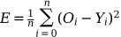

### Latex for Github markdown

#### Output Stdout
~~~python
python latex.py --input '$ E = \frac{1}{n} \sum_{i=0}^n (O_{i} - Y_{i})^2 $ --base64' 
~~~

#### Copy in clipboard
~~~python
python latex.py --input '$ E = \frac{1}{n} \sum_{i=0}^n (O_{i} - Y_{i})^2 $' --markdown | xclip -i -selection clipboard
~~~

> Example: 

> > 
